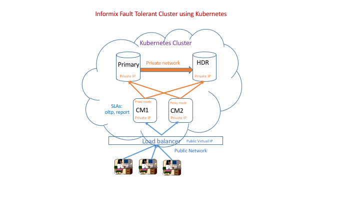

# kubernetes-informix-cluster

Please look at kubernetes_instructions.pdf file for project instructions.

You need Informix server and Client SDK tar files to build Informix Server and Connection Manager docker images.

URL to download Informix Server Developer edition:
https://www.ibm.com/developerworks/downloads/im/informix/

Copy tar file to kubernetes-informix-cluster/docker/server_ctx/iif.12.10.tar
Note: Make sure to rename target file to iif.12.10.tar. Dockerfile file in server_ctx refer to this file name.

URL to download Informix Client SDK  developer edition:
https://www-01.ibm.com/marketing/iwm/tnd/preconfig.jsp?id=2013-03-26+02%3A58%3A21.558674R&S_TACT=&S_CMP=

Copy tar file to kubernetes-informix-cluster/docker/cm_ctx/clientsdk.4.10.tar
Note: Make sure to rename target file to clientsdk.4.10.tar.  Dockerfile in cm_ctx directory refer to this file name.

Architecture Diagram:

